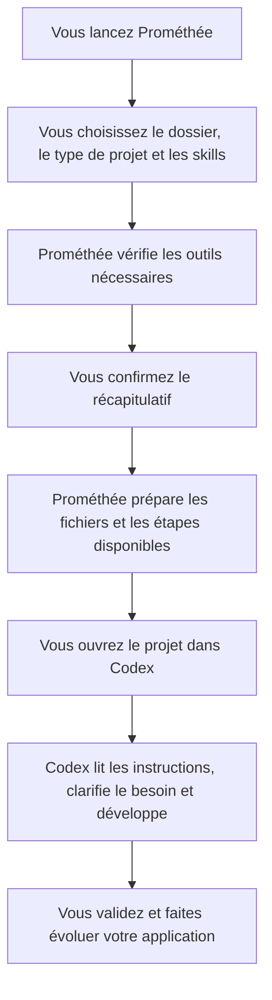
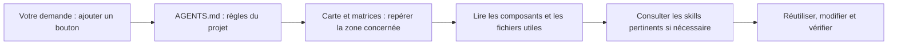

# Prométhée


**Préparer un projet de développement assisté par IA, depuis son terminal.**

Prométhée est un outil en ligne de commande, ou **CLI**. Il vous guide avec un menu : choisissez le dossier de votre projet, le type d’application et les compétences à donner à votre agent IA. Prométhée prépare ensuite une structure de départ, des instructions et une carte du projet pour travailler avec **Codex**.

Prométhée a été créé pour aider les personnes qui débutent, même sans connaissances en développement web, à démarrer un projet propre et bien structuré avec l’aide d’une IA. Il facilite les premiers choix techniques et fournit un cadre de bonnes pratiques pour que le projet puisse évoluer.

Le terminal est la fenêtre dans laquelle vous saisissez des commandes : Command Prompt ou PowerShell sous Windows, Terminal sous Ubuntu. Vous pouvez utiliser les menus de Prométhée sans mémoriser toutes ses commandes.

**Version actuelle : 0.2.0, en préversion.** Le menu, la préparation des projets et la gestion des skills sont disponibles. Certaines installations et vérifications natives restent en préparation : [voir les possibilités actuelles](#possibilités-actuelles).

## À quoi sert Prométhée ?

Pour démarrer un projet avec un agent IA, il faut lui donner un cadre : outils, organisation du code, règles de travail et contexte utile. Prométhée rassemble ces éléments dans le dossier du projet.

- **Préparer le départ** : choisir une base technique et une structure adaptées au type d’application.
- **Améliorer la qualité** : transmettre des règles de simplicité, de réutilisation des composants, d’accessibilité et de sécurité.
- **Soigner les interfaces** : proposer des skills pour éviter les compositions et les textes génériques souvent produits par l’IA.
- **Limiter le contexte inutile** : donner à l’agent des cartes et des matrices qui l’orientent vers les fichiers concernés par sa tâche.
- **Retrouver l’état du projet** : consulter les étapes effectuées, reprendre une préparation interrompue et proposer des mises à jour des skills.

L’objectif est d’économiser du temps et des tokens — les unités de texte lues et produites par l’IA — grâce à un contexte plus ciblé. Le gain dépend du projet et de la façon dont l’agent utilise ces documents.

Prométhée prépare le cadre de travail. Vous définissez votre application avec Codex, qui réalise ensuite ses fonctionnalités. L’hébergement, le déploiement et les services cloud payants sont hors du périmètre actuel.

## Le fonctionnement en un schéma



L’aperçu documentaire permet de découvrir les instructions et les skills sans installer les frameworks. Pour préparer le socle complet, le contrôle des outils doit réussir avant la création du dossier.

## Quels projets peut-on préparer ?

Un **framework** fournit une base de code et des conventions pour construire une application. Prométhée propose quatre familles de projets.

| Type de projet | Usage | Base proposée |
| --- | --- | --- |
| **Web React et API** | Application web avec une interface et un serveur qui traite les données | React, TypeScript et Vite ; API NestJS, TypeORM et PostgreSQL ; Tailwind et shadcn pour l’interface |
| **Web PHP Laravel** | Site ou application web pouvant viser un hébergement mutualisé compatible | Laravel, Blade et Eloquent ; MySQL ; Tailwind et Alpine. Livewire est proposé en option |
| **Application de bureau** | Application installée sur un ordinateur | Electron, React et TypeScript ; SQLite en option pour stocker des données localement |
| **Application mobile** | Application pour téléphone, avec un parcours Android prévu et un aperçu Expo Go | React Native, Expo, TypeScript et Expo Router ; SQLite en option ; connexion à une API existante ou ajout d’un backend NestJS/PostgreSQL |

Les choix supplémentaires dépendent du profil : animations, base locale, backend mobile et skills spécialisés. Les options encore en préparation sont signalées dans le menu.

L’architecture reste simple et peut évoluer : responsabilités séparées, composants existants réutilisés et complexité ajoutée lorsqu’elle répond à un besoin. Les instructions générées cadrent aussi les vérifications, les commits, la préférence pour rebase et le **push uniquement sur demande de l’utilisateur**.

## Télécharger Prométhée

Le dépôt du projet est [ThomRul/promethee sur GitHub](https://github.com/ThomRul/promethee). Il faut avoir accès au dépôt pour télécharger ses versions. Lorsqu’une version y est publiée, ouvrez **Releases**, choisissez la version, puis téléchargez l’archive correspondant à votre ordinateur dans **Assets**. [GitHub explique le fonctionnement des Releases](https://docs.github.com/en/repositories/releasing-projects-on-github/about-releases).

Pour utiliser Prométhée sans compiler son code, choisissez l’une de ces archives :

| Votre ordinateur | Archive de la préversion 0.2.0 |
| --- | --- |
| Windows 11 x64 | `promethee-0.2.0-windows-x64-preview.zip` |
| Ubuntu 24.04 x64, y compris sous WSL déjà installé | `promethee-0.2.0-ubuntu-x64-preview.tar.gz` |

**Dans la livraison locale actuelle, ces archives sont dans le dossier `releases/`. Elles ne sont pas incluses dans le code versionné et aucune Release GitHub n’est publiée à ce stade.** Les fichiers `.sha256` associés permettent de vérifier que les archives téléchargées correspondent aux fichiers distribués.

Les téléchargements GitHub nommés **Source code** servent à récupérer le code à compiler : [voir la procédure pour les sources](#travailler-sur-le-code-de-prométhée).

`x64` désigne ici un ordinateur 64 bits Intel ou AMD. Les ordinateurs ARM et 32 bits ne sont pas pris en charge dans cette préversion. Cela concerne l’ordinateur qui exécute Prométhée ; le type de processeur du téléphone est une question distincte.

## Installer et lancer sous Windows

L’archive contient le programme compilé et le moteur nécessaire pour le lancer. Pour utiliser cette distribution, **téléchargez, extrayez puis lancez** : aucune compilation n’est nécessaire.

1. Téléchargez l’archive Windows.
2. Faites un clic droit sur le ZIP, puis choisissez **Extraire tout**.
3. Choisissez un emplacement facile à retrouver, par exemple le dossier `Tools` de votre compte Windows.
4. Repérez le dossier extrait qui contient **`promethee.cmd`**. Conservez ensemble tous les fichiers de ce dossier.
5. Ouvrez PowerShell ou Command Prompt dans ce dossier, puis lancez Prométhée.

Si vous avez extrait le dossier dans `Tools`, voici les commandes. Adaptez le chemin si vous avez choisi un autre emplacement.

**Avec PowerShell :**

```powershell
Set-Location "$env:USERPROFILE\Tools\promethee-0.2.0-windows-x64-preview"
.\promethee.cmd
```

**Avec Command Prompt :**

```bat
cd /d "%USERPROFILE%\Tools\promethee-0.2.0-windows-x64-preview"
promethee.cmd
```

Le menu s’ouvre avec l’emblème de la main et du feu. Utilisez les **flèches** pour naviguer, **Entrée** pour valider, **Espace** pour cocher les skills et **Échap** pour annuler.

Le moteur Node fourni dans l’archive sert uniquement à Prométhée. Il reste dans son dossier et ne change pas le Node utilisé par vos projets.

## Installer et lancer sous Ubuntu

Téléchargez l’archive Ubuntu. Dans cet exemple, elle se trouve dans `Downloads` et sera extraite dans `Tools`. Adaptez le chemin si votre dossier s’appelle `Téléchargements` ou si vous avez choisi un autre emplacement.

```bash
mkdir -p "$HOME/Tools"
tar -xzf "$HOME/Downloads/promethee-0.2.0-ubuntu-x64-preview.tar.gz" -C "$HOME/Tools"
cd "$HOME/Tools/promethee-0.2.0-ubuntu-x64-preview"
./promethee
```

Les menus et les étapes sont les mêmes que sous Windows. Sous WSL, utilisez l’archive Ubuntu depuis votre terminal Ubuntu. Prométhée n’installe ni WSL ni Docker.

L’archive Ubuntu est construite et son contenu est contrôlé. Son exécution sur Ubuntu et WSL reste à valider pour cette préversion.

## Créer votre premier projet

1. Lancez Prométhée et choisissez **Créer un nouveau projet**.
2. Parcourez les dossiers pour choisir l’emplacement. Donnez ensuite un nom au nouveau dossier et au projet.
3. Indiquez si votre idée est déjà cadrée. Codex pourra préciser les informations techniques manquantes ou vous aider à définir un périmètre avec des questions ciblées.
4. Choisissez le type d’application et ses options.
5. Sélectionnez les skills. Les suggestions restent modifiables : vous pouvez cocher ou décocher chaque skill proposé.
6. Choisissez **Préparer le socle et installer ses dépendances** ou **Préparer un aperçu des documents et skills**.
7. Lisez le récapitulatif, vérifiez le dossier de destination puis confirmez.

Pour découvrir Prométhée dès maintenant, l’**aperçu documentaire** prépare les instructions, les cartes et les skills sans demander l’installation des frameworks. Cet aperçu reste documentaire lors d’une reprise. Pour créer ensuite un socle complet, relancez la création dans un nouveau dossier.

Une création part d’un nouveau dossier ou d’un dossier vide. Prométhée ne transforme pas automatiquement un projet existant en projet suivi.

### Ce que vous retrouvez dans le dossier

```text
mon-projet/
├── AGENTS.md                 Règles de travail pour l’agent
├── PROJECT.md                Périmètre et décisions du projet
├── handoff.txt               Point de départ pour Codex
├── .agents/skills/           Skills sélectionnés
├── docs/agent-map/           Carte des zones et matrices de routage
├── docs/agent-guides/        Guides adaptés au profil et aux options
├── .promethee/manifest.json  Suivi des étapes de préparation
└── …                        Code de départ selon le profil et le mode choisi
```

En mode socle, les fichiers de l’application sont ajoutés selon le profil : par exemple `frontend/` et `backend/` pour le web React/API. Le suivi indique ce qui a réellement été effectué et ce qui reste à faire.

### Passer le relais à Codex

Ouvrez le dossier de votre projet dans Codex. Vous pouvez commencer avec ce message, en ajoutant votre idée ou votre brief :

```text
Lis handoff.txt et AGENTS.md, puis vérifie les étapes restantes de préparation.
Aide-moi à poursuivre ce projet en tenant compte du périmètre déjà enregistré.
Voici ce que je veux construire : …
```

Les instructions demandent à l’agent de clarifier le besoin, de vérifier la préparation et de poser la question de Docker avant le développement. Les choix retenus doivent ensuite être reportés dans les documents du projet.

## Les skills et le contexte de l’agent

Un **skill** est un ensemble d’instructions spécialisées, parfois accompagné de ressources ou de scripts. Il aide l’agent à traiter une tâche : concevoir une interface, examiner l’accessibilité, chercher des risques de sécurité ou rendre un texte plus naturel.

Prométhée propose un catalogue sélectionné et des révisions fixées. Vous choisissez les skills dans le menu ; le CLI les copie depuis sa distribution. Les copies livrées conservent leurs licences MIT ou Apache 2.0 et leurs mentions d’origine. Les entrées dont la redistribution n’est pas qualifiée restent indisponibles.

Les documents s’adaptent à votre sélection : ils indiquent **quel skill utiliser, pour quelle tâche et dans quelles limites**. Tous les skills ne doivent pas être chargés pour chaque demande.



La carte fournit une orientation à l’agent. Elle doit évoluer avec l’application : elle ne remplace pas la lecture des fichiers utiles ni les vérifications du code.

## Commandes utiles

Les exemples Windows ci-dessous s’exécutent dans le dossier de Prométhée, avec PowerShell. Remplacez `C:\Projets\mon-projet` par le chemin réel d’un projet créé avec Prométhée. Sous Command Prompt, utilisez `promethee.cmd` à la place de `.\promethee.cmd`.

| Besoin | Commande PowerShell |
| --- | --- |
| Ouvrir le menu | `.\promethee.cmd` |
| Lancer les questions de création | `.\promethee.cmd create` |
| Afficher l’aide | `.\promethee.cmd --help` |
| Afficher la version | `.\promethee.cmd --version` |
| Examiner la machine et les outils communs | `.\promethee.cmd doctor` |
| Voir l’état d’un projet | `.\promethee.cmd status --project "C:\Projets\mon-projet"` |
| Reprendre une préparation interrompue | `.\promethee.cmd resume --project "C:\Projets\mon-projet"` |
| Consulter les services associés | `.\promethee.cmd services --project "C:\Projets\mon-projet"` |
| Proposer une mise à jour des skills | `.\promethee.cmd skills update --project "C:\Projets\mon-projet"` |

Sous Ubuntu, les mêmes arguments s’ajoutent à `./promethee` :

```bash
./promethee create
./promethee status --project "$HOME/Projets/mon-projet"
./promethee resume --project "$HOME/Projets/mon-projet"
./promethee skills update --project "$HOME/Projets/mon-projet"
```

La création, la reprise et les mises à jour conservent leurs menus et leurs confirmations. Pour annuler une action interactive, utilisez Échap.

Pour récupérer un résultat structuré au format JSON, ajoutez `--json` au diagnostic ou à la consultation d’un projet explicitement choisi :

```powershell
.\promethee.cmd doctor --json
.\promethee.cmd status --project "C:\Projets\mon-projet" --json
```

`status --json` affiche le suivi enregistré. `doctor` examine actuellement la machine et les outils communs du parcours Electron, dont Node, npm, Git et Python. Les besoins complets du profil choisi sont contrôlés pendant la création ou la reprise.

## Possibilités actuelles

La préversion fournit un CLI utilisable, tout en gardant visibles les étapes qui restent à terminer.

| Élément | État de la préversion |
| --- | --- |
| Menu, navigation et sélection manuelle | Disponibles |
| Instructions, skills, cartes et matrices selon les choix | Disponibles |
| Génération du socle et installation de ses dépendances | Disponibles lorsque les outils requis sont déjà compatibles et les options admissibles |
| Installation des outils système absents | Recettes encore à qualifier ; le parcours s’arrête si un outil requis manque |
| Consultation, reprise et mises à jour des skills | Disponibles ; les modifications locales sont préservées par défaut |
| Configuration et démarrage/arrêt des bases natives | Encore à qualifier ; les actions restent bloquées tant que les conditions ne sont pas validées |
| Android local, émulateur, MariaDB et animations éditoriales GSAP | Préparation documentaire possible ; installation complète encore indisponible |
| Distribution Windows | Archive extraite et lanceur testés |
| Distribution Ubuntu/WSL | Archive construite et contrôlée ; exécution sur Linux encore à valider |

Prométhée ne démarre pas automatiquement votre application, son serveur de développement ou ses services au lancement du CLI. Les commandes propres au projet sont expliquées dans les guides générés. Les bases Docker, distantes et SQLite conservent leur gestion propre.

### Si une version d’outil est incompatible

L’archive suffit pour ouvrir Prométhée, mais vos projets ont leurs propres outils. Le socle JavaScript demande actuellement **Node 24, à partir de 24.21.0 et avant 25**, ainsi que npm 11. Git est requis lorsqu’il est sélectionné, Python pour certains skills, et PHP/Composer pour Laravel. Les extensions et les autres exigences sont vérifiées selon le profil.

Si un outil présent est incompatible, Prométhée arrête la préparation et affiche les exigences. Votre installation existante est conservée. Installez ou activez vous-même une version compatible, puis relancez l’action. Pour Node, utilisez le [site officiel](https://nodejs.org/en/download) en sélectionnant la branche 24 compatible. Une version plus récente d’une autre branche peut aussi être refusée.

Les commandes suivantes permettent de vérifier les versions actives dans votre terminal :

```text
node --version
npm --version
```

### Si une préparation est interrompue

Relancez Prométhée, choisissez **Reprendre une préparation**, puis le dossier concerné. Le CLI refait les contrôles nécessaires et conserve vos modifications. Il réutilise les étapes réussies encore valables et suit les étapes incomplètes. Une étape suspendue dans cette version reste en attente de sa qualification.

Si le catalogue a changé après une mise à jour du CLI, une reprise peut être refusée : cette commande ne migre pas automatiquement un ancien socle. Conservez l’ancienne version de Prométhée pour terminer une préparation interrompue.

## Mettre à jour Prométhée et les skills

Lorsqu’une nouvelle archive est fournie, extrayez-la dans un nouveau dossier et lancez cette version. Vos projets restent dans les emplacements que vous avez choisis.

Pour un projet suivi, utilisez ensuite **Mettre à jour les skills**, ou la commande `skills update --project "CHEMIN_DU_PROJET"`. Prométhée compare les copies du projet au catalogue livré avec cette version du CLI. Il conserve les personnalisations par défaut ; un remplacement explicitement choisi reçoit une sauvegarde complète.

Cette commande utilise le catalogue fourni avec Prométhée. Il n’y a pas de recherche automatique de skills sur GitHub ni de mise à jour automatique vers une révision non vérifiée.

## Travailler sur le code de Prométhée

Pour modifier le CLI, récupérez son **code source**. Avec un accès au dépôt GitHub, exécutez :

```text
git clone https://github.com/ThomRul/promethee.git promethee
cd promethee
npm ci
npm run build
npm start
```

Ces commandes s’exécutent dans le dossier cloné, avec Node 24 et npm compatibles installés sur votre machine. Elles installent les dépendances du CLI, compilent son code puis ouvrent son menu. L’archive prête à lancer est utilisée avec son propre lanceur ; les commandes npm ci/build/start concernent le code source.

Quelques commandes pour vérifier une modification :

```text
npm run typecheck
npm test
npm run verify:resources
npm run format:check
```

Le code est organisé en trois parties : `src/cli` pour le terminal, `src/core` pour les projets et leur contexte, `src/system` pour les outils et services. Les ressources du catalogue ont des empreintes de contrôle : leur modification doit être accompagnée d’une nouvelle vérification.

## Documents complémentaires

- [Spécification du projet](SPECIFICATION.md) : périmètre et décisions retenues.
- [Travaux restant à terminer](A-TERMINER.md) : étapes ouvertes pour compléter le MVP.
- [Revue de l’implémentation](docs/IMPLEMENTATION-REVIEW.md) : contrôles effectués et qualifications restantes.
- [Versions des outils et frameworks](VERSIONS.md) : références retenues.

La validation locale comprend **58 tests réussis et un ignoré** sur l’hôte Windows de préparation, ainsi que la compilation et les contrôles d’intégrité. Ces résultats ne constituent pas une validation de toutes les applications natives ou des bases de données.

Le code de Prométhée est destiné à un dépôt privé dans un premier temps. Sa licence reste à choisir avant publication publique ; les ressources tierces conservent leurs licences et leurs mentions d’origine.
